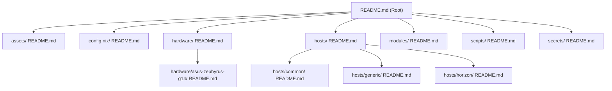

# horizon - NixOS Dotfiles

NixOS system configuration flake for the host `horizon` using Home Manager, Nixvim, Hyprland, and agenix.

## Repository Map & Documentation

Below is a visual map of the repository's configuration components. You can use the quick links below to navigate to the detailed documentation for each directory.



### Documentation Quick Links
- 📂 [assets/](file:///home/conart/nixdots/assets/README.md) — System assets, wallpapers, screenshots, and icons.
- 📂 [config.nix/](file:///home/conart/nixdots/config.nix/README.md) — Unified styling, colors, and fonts configuration.
- 📂 [hardware/](file:///home/conart/nixdots/hardware/README.md) — Modular hardware profiles.
  - 📂 [hardware/asus-zephyrus-g14/](file:///home/conart/nixdots/hardware/asus-zephyrus-g14/README.md) — Asus Zephyrus G14 GPU and system tuning.
- 📂 [hosts/](file:///home/conart/nixdots/hosts/README.md) — System host definitions.
  - 📂 [hosts/common/](file:///home/conart/nixdots/hosts/common/README.md) — Core configurations shared across all machines.
  - 📂 [hosts/generic/](file:///home/conart/nixdots/hosts/generic/README.md) — Fallback target configuration.
  - 📂 [hosts/horizon/](file:///home/conart/nixdots/hosts/horizon/README.md) — Main setup for host `horizon`.
- 📂 [modules/](file:///home/conart/nixdots/modules/README.md) — Home Manager and user environment modules (Hyprland, Nixvim, Shell, Kitty, etc.).
- 📂 [scripts/](file:///home/conart/nixdots/scripts/README.md) — Maintenance and helper utility scripts.
- 📂 [secrets/](file:///home/conart/nixdots/secrets/README.md) — Secure age-encrypted system credentials.

---

## Architecture & Features

- **OS**: NixOS (using `nixpkgs` stable/unstable release 26.05)
- **WM**: Hyprland (configured via Home Manager)
- **Editor**: Nixvim (Neovim configuration packaged inside Nix)
- **Terminal**: Kitty & Fish
- **Secrets Management**: `agenix` (using age for decrypting SSH keys and GitHub PATs dynamically at boot/rebuild time)

---

## Secrets Management & Bootstrapping

We use `agenix` to securely handle credentials (like your SSH private key and GitHub PAT) without checking plaintext secrets into a public Git repository.

Plaintext credentials are kept in the gitignored `.secrets/` directory during setup.

### How to Bootstrap (New Keys/Tokens)

If you want to set up this system with **brand-new** credentials:

1. Clone this repository.
2. Run the bootstrap script:
   ```bash
   ./scripts/bootstrap-secrets.sh
   ```
   * This script will:
     - Generate a master recovery age key at `~/.config/sops/age/keys.txt`.
     - Generate a new SSH key pair inside `.secrets/`.
     - Ask you to enter a GitHub Personal Access Token (PAT) and save it to `.secrets/github-pat`.
     - Encrypt the SSH private key and PAT into `secrets/github-ssh-key.age` and `secrets/github-pat.age`.
3. Commit the newly generated encrypted `.age` files in the `secrets/` directory.
4. Run your rebuild alias to switch configuration:
   ```bash
   sudo nixos-rebuild switch --flake .#horizon
   ```
5. Register your new SSH key with GitHub using the GitHub CLI:
   ```bash
   GITHUB_TOKEN=$(cat ~/.config/gh/github-pat) gh ssh-key add .secrets/id_ed25519.pub --title "Horizon NixOS"
   ```

---

### How to Restore (Using Existing Keys)

If you are reinstalling NixOS or deploying to a new system and want to **restore your existing credentials**:

1. Clone this repository.
2. Copy your previously backed up `keys.txt` recovery key file to `~/.config/sops/age/keys.txt`.
3. Apply the system configuration:
   ```bash
   sudo nixos-rebuild switch --flake .#horizon
   ```
4. **Done!** `agenix` will automatically decrypt your existing SSH private key and GitHub Personal Access Token directly to `~/.ssh/id_ed25519` and `~/.config/gh/github-pat`.
